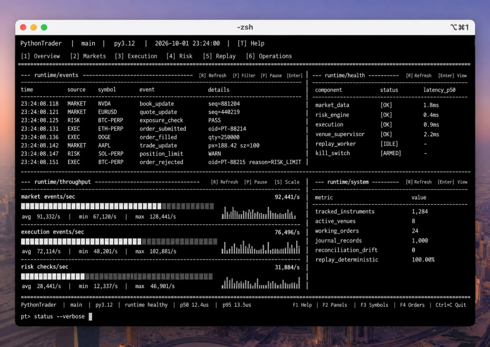
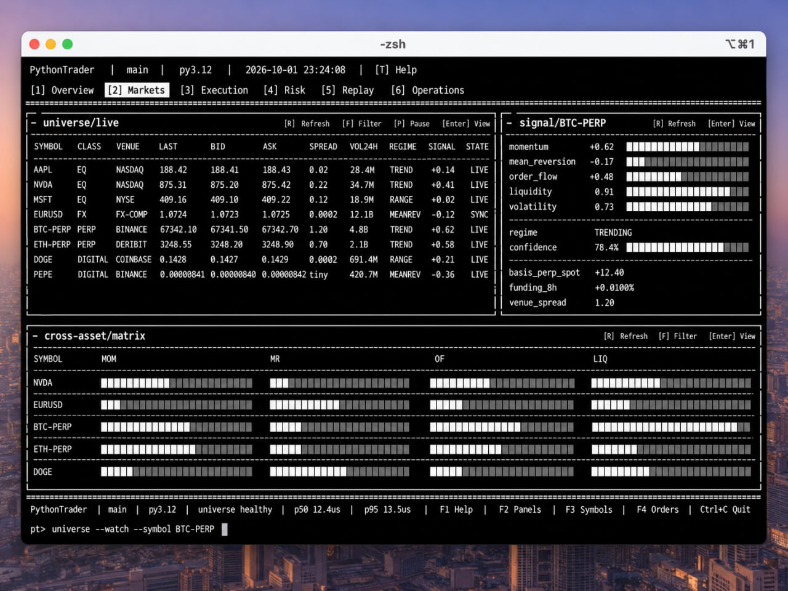
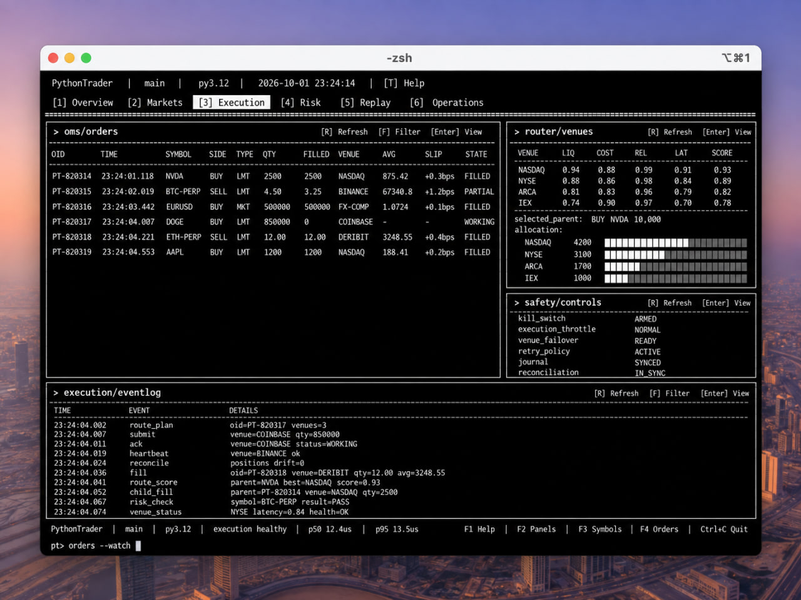
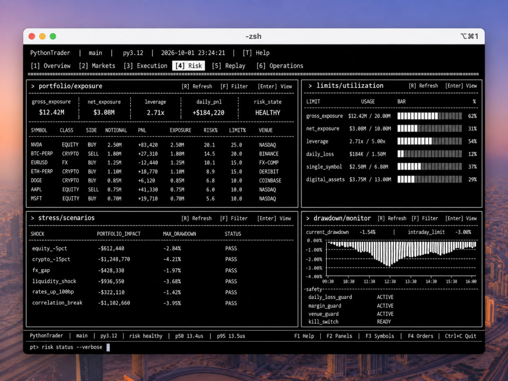
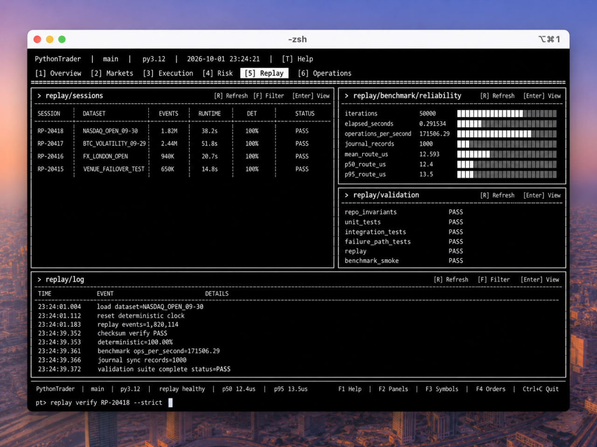
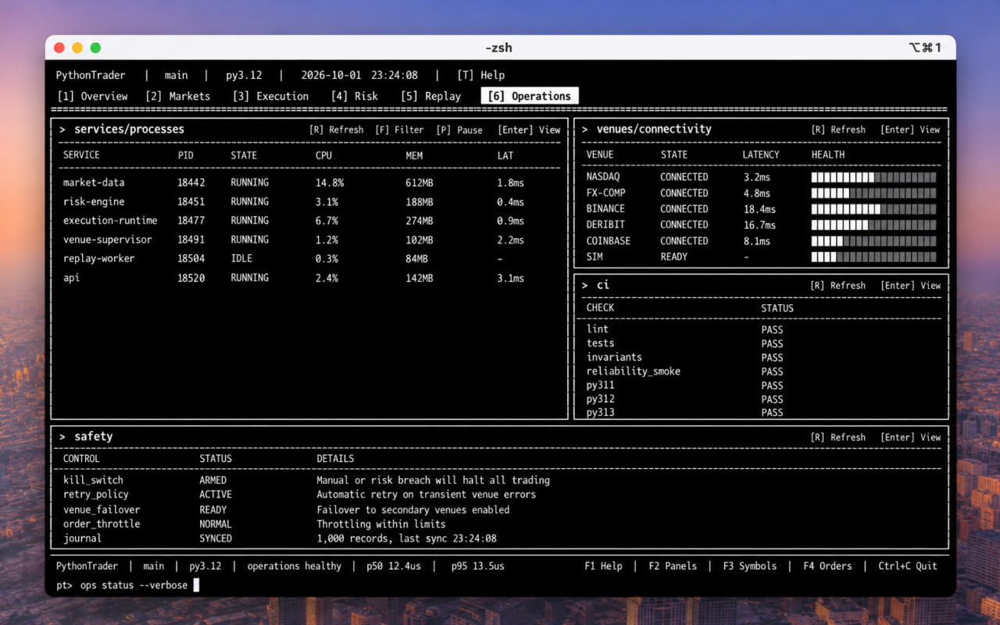

<p align="center">
  
</p>

<h1 align="center">PythonTrader</h1>

<p align="center">
  <strong>Autonomous multi-asset trading, execution, risk and replay infrastructure.</strong>
</p>

<p align="center">
  A modular Python platform for building, testing and supervising trading systems across equities, FX, perpetuals and digital assets.
</p>

<p align="center">
  <a href="#-overview">Overview</a> ·
  <a href="#-markets--universe">Markets</a> ·
  <a href="#-execution">Execution</a> ·
  <a href="#-risk-engine">Risk</a> ·
  <a href="#-replay--research">Replay</a> ·
  <a href="#-operations">Operations</a> ·
  <a href="#-getting-started">Getting Started</a>
</p>

<p align="center">
  
  
  
  
  
</p>

---

# 🧭 Overview

PythonTrader is a modular trading infrastructure project built around a unified runtime for:

- market data ingestion,
- instrument discovery,
- strategy and signal evaluation,
- portfolio-level risk controls,
- smart order routing,
- order lifecycle management,
- venue supervision,
- deterministic replay,
- failure recovery,
- benchmarking,
- and operational monitoring.

The goal is not to reduce trading to a single strategy.

The goal is to provide a common **execution and control layer** underneath very different trading workflows.

A large-cap equity, an FX pair, a perpetual contract and a volatile digital asset have very different market structure, liquidity and risk characteristics. PythonTrader keeps those differences at the asset-model layer while exposing a shared runtime around them.

```text
Market Data
     │
     ▼
Normalized Events
     │
     ▼
Features / Models / Intelligence
     │
     ▼
Portfolio Intent
     │
     ▼
Risk Engine
     │
     ▼
Execution Planning
     │
     ▼
Smart Order Router
     │
     ▼
Venue Adapters
     │
     ▼
Execution Journal / Reconciliation / Replay
```

---

# 🖥️ Runtime Overview



The runtime view is designed as an engineering-oriented terminal surface rather than a consumer trading dashboard.

It exposes the state that matters during execution:

- live market and execution events,
- component health,
- event throughput,
- active venue count,
- working order count,
- journal state,
- reconciliation drift,
- and replay determinism.

The runtime layer coordinates the rest of the system while keeping state observable and inspectable.

A representative event flow:

```text
23:24:08.118 MARKET   NVDA      book_update
23:24:08.125 RISK     BTC-PERP  exposure_check    PASS
23:24:08.131 EXEC     ETH-PERP  order_submitted
23:24:08.136 EXEC     DOGE      order_filled
```

PythonTrader intentionally separates **decision making** from **execution safety**.

A strategy can produce intent, but that intent can still be blocked by:

1. instrument validation,
2. exposure checks,
3. leverage limits,
4. portfolio constraints,
5. execution throttles,
6. venue state,
7. kill-switch state,
8. reconciliation state,
9. routing policy,
10. order lifecycle rules.

---

# 🌐 Markets & Universe



The universe layer provides a normalized cross-asset instrument registry.

It exists to prevent the rest of the system from becoming a collection of hardcoded symbols and venue assumptions.

## Supported research surfaces

### Equities

Traditional listed instruments with symbol, venue and order-book state.

### FX

Currency-pair oriented models with spread, liquidity and venue-aware routing.

### Perpetuals

Derivative instruments where leverage, funding and derivative-specific exposure can be represented independently from spot markets.

### Digital assets

Assets where liquidity quality, concentration, volatility and execution risk may need stronger weighting than simple price signals.

A common instrument representation can look like:

```python
Instrument(
    symbol="BTC-PERP",
    asset_class=AssetClass.PERPETUAL,
    venue="BINANCE",
)
```

Asset-specific modules can then extend the common model.

```text
Equity
├── symbol
├── venue
├── sector
└── liquidity state

Perpetual
├── symbol
├── leverage constraints
├── funding context
└── derivative-specific exposure

Digital Asset
├── symbol
├── liquidity quality
├── volatility state
├── concentration
└── venue risk
```

---

# 📡 Market Data

Trading logic is only as useful as the state supplied to it.

PythonTrader contains a normalized market-data layer designed to isolate strategy and execution code from venue-specific message formats.

The market-data stack can represent:

- quotes,
- trades,
- bid / ask updates,
- order-book levels,
- instrument state,
- venue state,
- sequence information,
- and normalized runtime events.

A typical flow looks like:

```text
Venue Feed
   ↓
Adapter
   ↓
Normalizer
   ↓
Sequence / State Validation
   ↓
Market Data Router
   ↓
Order Book / Features / Strategies
```

Normalized state allows strategy, risk, replay and execution layers to reason over the same event model.

---

# 🧠 Intelligence Layer

The intelligence layer transforms market state into structured trading context.

Rather than coupling a strategy directly to raw venue messages, PythonTrader can expose signals such as:

- momentum,
- mean reversion,
- order-flow state,
- volatility,
- liquidity,
- market regime,
- asset-specific features,
- and portfolio context.

```text
Raw Market Data
      ↓
Normalized State
      ↓
Feature Extraction
      ↓
Market Context
      ↓
Planner / Strategy
      ↓
Trading Intent
      ↓
Risk Validation
```

The strategy decides **what** it wants to do.

Execution, risk, recovery and venue supervision remain separate responsibilities.

---

# ⚡ Execution



The execution layer provides a common lifecycle around orders while isolating strategy code from venue-specific execution mechanics.

## Order Management System

The OMS tracks state transitions such as:

```text
CREATED
   ↓
ACCEPTED
   ↓
PARTIALLY_FILLED
   ↓
FILLED
```

Alternative transitions include:

```text
CREATED → REJECTED
ACCEPTED → CANCELED
PARTIALLY_FILLED → CANCELED
```

The execution stack validates:

- order identity,
- requested quantity,
- filled quantity,
- remaining quantity,
- state transitions,
- venue acknowledgements,
- and reconciliation state.

## Smart Order Routing

The routing layer can break a parent execution request into venue-aware child orders.

```text
Parent Order
   │
   ├── NASDAQ ── Child Order
   ├── NYSE   ── Child Order
   ├── ARCA   ── Child Order
   └── IEX    ── Child Order
```

A routing decision may incorporate:

- available liquidity,
- expected execution cost,
- spread,
- venue reliability,
- fill probability,
- latency,
- order size,
- and routing policy.

The strategy decides **what** to trade.

The execution layer decides **how** that intent should be routed.

## Execution Reliability

PythonTrader includes reliability primitives around execution:

- retry policies,
- execution journals,
- reconciliation,
- recovery logic,
- venue failover,
- websocket supervision,
- kill-switch controls,
- and execution throttling.

The recovery model is built around a simple assumption:

> process state is temporary; execution state must be reconstructable.

---

# 🛡️ Risk Engine



The risk engine sits between trading intent and execution.

Representative policy fields include:

```python
RiskPolicy(
    max_gross=...,
    max_net=...,
    max_symbol=...,
    max_leverage=...,
    max_daily_loss=...,
)
```

The broader risk architecture can evaluate:

- gross exposure,
- net exposure,
- symbol concentration,
- asset-class concentration,
- leverage,
- realized and unrealized losses,
- daily loss limits,
- stress scenarios,
- and order-level constraints.

## Stateful risk

Risk cannot be evaluated using an order in isolation.

```text
Incoming Order
      +
Current Portfolio State
      +
Configured Risk Policy
```

The same order may be valid with an empty portfolio and invalid when current exposure is already near its configured limit.

## Stress scenarios

A risk surface can evaluate scenarios such as:

- equity selloff,
- crypto volatility shock,
- FX gap,
- liquidity shock,
- rates move,
- correlation break.

This makes pre-trade policy and portfolio supervision explicit rather than implicit.

---

# 🔁 Replay & Research



Replay is a first-class component rather than an afterthought.

A deterministic replay environment allows the platform to reconstruct a previous event stream and pass it through the same core components used by a runtime session.

This makes replay useful for:

- strategy regression testing,
- execution regression testing,
- risk-rule validation,
- incident reconstruction,
- deterministic debugging,
- and performance analysis.

```text
Recorded Events
      ↓
Deterministic Clock
      ↓
Replay Runtime
      ↓
Market Data
      ↓
Strategy
      ↓
Risk
      ↓
Execution
      ↓
Recorded Results
```

If the same:

- code,
- configuration,
- initial state,
- and event sequence

are supplied, the replay system should produce equivalent state transitions.

---

# 📊 Benchmarks

PythonTrader includes benchmark tooling for execution and reliability paths.

Example reliability benchmark output:

```json
{
  "elapsed_seconds": 0.291534,
  "iterations": 50000,
  "journal_records": 1000,
  "operations_per_second": 171506.29,
  "schema": "pythontrader.reliability.benchmark.v1",
  "tail_checksum": "422dc2e04652975a17acc0bfd075d7fabd306617789e79a67380696ab95f99ad"
}
```

These benchmark numbers are intended primarily as regression indicators.

They should not be interpreted as guaranteed real-world exchange latency.

Actual production latency depends on:

- hardware,
- operating system,
- network path,
- venue infrastructure,
- serialization,
- transport,
- and deployment architecture.

---

# 🧰 Operations



Operational visibility is essential for an execution platform.

PythonTrader exposes service and venue state in a compact operations console.

Operational surfaces can include:

- runtime process state,
- CPU / memory usage,
- venue connectivity,
- service latency,
- replay worker state,
- CI status,
- kill-switch state,
- retry policy,
- venue failover,
- execution throttling,
- and journal synchronization.

A simplified health snapshot:

```text
market-data         RUNNING
risk-engine         RUNNING
execution-runtime   RUNNING
venue-supervisor    RUNNING
replay-worker       IDLE
api                 RUNNING

NASDAQ              CONNECTED
FX-COMP              CONNECTED
BINANCE              CONNECTED
DERIBIT              CONNECTED
COINBASE             CONNECTED
SIM                  READY
```

---

# 🔌 Venue Adapters

PythonTrader contains venue-oriented abstractions so trading infrastructure can be exercised without coupling the entire application to one exchange.

Adapters can support:

- market-data normalization,
- order serialization,
- response handling,
- websocket supervision,
- retries,
- reconciliation,
- and failover behavior.

Testnet or simulated environments are useful for validating infrastructure but should not be interpreted as proof of live trading performance.

---

# 🚨 Failure Handling

Failure paths are explicitly testable.

## Venue unavailable

```text
Primary Venue
     ↓
Connection Failure
     ↓
Venue Health Update
     ↓
Failover Decision
     ↓
Alternative Venue
```

## Execution uncertainty

```text
Order Submitted
      ↓
Connection Interrupted
      ↓
Execution State Unknown
      ↓
Journal Lookup
      ↓
Venue Reconciliation
      ↓
Recovered Order State
```

## Safety event

```text
Risk Breach
    ↓
Kill Switch
    ↓
Block New Execution
    ↓
Reconcile Existing Orders
```

This design avoids assuming that every request receives a clean synchronous response.

---

# 🗂️ Repository Structure

```text
python-trader/
│
├── .github/
│   └── workflows/
│
├── docs/
│   └── images/
│
├── scripts/
│   ├── benchmark_execution_v4.py
│   ├── benchmark_reliability_v5.py
│   └── repo_invariants.py
│
├── src/
│   └── pythontrader/
│       ├── agents/
│       ├── alpha/
│       ├── analytics/
│       ├── api/
│       ├── asset_models/
│       ├── autonomy/
│       ├── backtest/
│       ├── core/
│       ├── execution/
│       ├── features/
│       ├── intelligence/
│       ├── market_making/
│       ├── marketdata/
│       ├── protocols/
│       ├── replay/
│       ├── research/
│       ├── risk/
│       ├── scheduler/
│       ├── security/
│       ├── storage/
│       ├── universe/
│       └── venues/
│
├── tests/
├── tools/
├── web/
├── pyproject.toml
└── README.md
```

---

# 🧩 Platform Architecture

```text
┌──────────────────────────────────────────────────────┐
│                    Market Sources                    │
│  Equities · FX · Perpetuals · Digital Asset Venues  │
└───────────────────────┬──────────────────────────────┘
                        │
                        ▼
┌──────────────────────────────────────────────────────┐
│                   Market Data Layer                  │
│   Normalization · Books · Quotes · Sequence State    │
└───────────────────────┬──────────────────────────────┘
                        │
                        ▼
┌──────────────────────────────────────────────────────┐
│                Intelligence / Strategy               │
│ Features · Regime · Signals · Planning · Strategies │
└───────────────────────┬──────────────────────────────┘
                        │
                        ▼
┌──────────────────────────────────────────────────────┐
│                     Risk Engine                      │
│ Exposure · Limits · Leverage · Loss · Concentration │
└───────────────────────┬──────────────────────────────┘
                        │
                        ▼
┌──────────────────────────────────────────────────────┐
│                   Execution Layer                    │
│ OMS · Routing · Throttles · Recovery · Reconciliation│
└───────────────────────┬──────────────────────────────┘
                        │
                        ▼
┌──────────────────────────────────────────────────────┐
│                     Venue Layer                      │
│       Testnet · Simulated · Exchange Adapters        │
└───────────────────────┬──────────────────────────────┘
                        │
              ┌─────────┴─────────┐
              ▼                   ▼
       Execution Journal       Replay
```

---

# 🧪 Design Principles

1. **Explicit state** — orders, fills, positions, health state and execution events should be inspectable.
2. **Deterministic core logic** — core components should remain reproducible enough for replay and regression tests.
3. **Strategy / execution separation** — signals should not contain networking, retry or venue-failover logic.
4. **Risk before routing** — execution should not bypass portfolio policy.
5. **Failure is normal** — disconnects, retries and uncertain execution states are expected operational conditions.
6. **Testability** — core infrastructure should remain usable without requiring a live exchange connection.

---

# 🚀 Getting Started

## Requirements

```text
Python 3.11+
pip
Git
```

Clone:

```bash
git clone https://github.com/ChristopherCain/python-trader-public.git
cd python-trader-public
```

Create an environment:

### Linux / macOS

```bash
python -m venv .venv
source .venv/bin/activate
```

### Windows PowerShell

```powershell
python -m venv .venv
.venv\Scripts\Activate.ps1
```

### Windows Git Bash

```bash
python -m venv .venv
source .venv/Scripts/activate
```

Install:

```bash
python -m pip install --upgrade pip
pip install -e ".[dev]"
```

---

# ✅ Running Tests

```bash
python -m pytest
```

Run repository invariants:

```bash
PYTHONPATH=src python scripts/repo_invariants.py
```

---

# 📈 Reliability Benchmark

```bash
PYTHONPATH=src python scripts/benchmark_reliability_v5.py --iterations 50000 --json
```

Short smoke run:

```bash
PYTHONPATH=src python scripts/benchmark_reliability_v5.py --iterations 1000 --json
```

---

# 🔄 CI

The repository uses GitHub Actions to validate multiple supported Python versions.

Current CI responsibilities include:

- dependency installation,
- correctness-focused linting,
- tests,
- repository invariants,
- reliability benchmark smoke tests.

---

# 🧪 Testing Strategy

PythonTrader uses multiple forms of validation:

- **Unit tests** — individual models and infrastructure components.
- **Integration tests** — runtime pipelines where multiple modules interact.
- **Execution tests** — order lifecycle, routing and reliability behavior.
- **Property / invariant tests** — conditions that must remain true across state transitions.
- **Replay tests** — deterministic reproduction of runtime behavior.
- **Failure-path tests** — venue loss, retries, recovery and other non-happy-path behavior.

---

# 🌿 Development Workflow

```bash
git checkout -b feature/my-change
pytest
PYTHONPATH=src python scripts/repo_invariants.py
```

Execution and reliability changes should also be checked against benchmark behavior.

---

# 🌳 Branch Model

```text
main
develop

feature/pythontrader-core
feature/trading-systems
feature/testnet-venues
feature/execution-reliability
feature/failure-injection

benchmark/reliability-v5

build/pythontrader
release/pythontrader-v0.5
```

`main` represents the current integrated project state.

---

# 🎯 Current Focus

Development is currently focused on strengthening infrastructure around:

- deterministic execution,
- multi-venue routing,
- execution recovery,
- market-data supervision,
- venue adapters,
- portfolio risk,
- replay,
- benchmarking,
- and operational reliability.

The project is intentionally infrastructure-heavy.

The purpose is to build a reliable foundation on which more sophisticated trading and research systems can later be placed.

---

# ⚠️ Scope

PythonTrader is not presented as:

- a guaranteed profitable trading strategy,
- a production-certified broker,
- a replacement for exchange risk controls,
- a guarantee of real-world latency,
- or evidence of profitable live trading.

Replay, benchmark and simulated/testnet functionality should be interpreted as engineering validation tools.

---

# 🔐 Security

Do not commit:

```text
exchange API secrets
private keys
wallet seed phrases
production credentials
database passwords
private endpoints
```

Use environment variables or an appropriate secret manager.

---

# 🗺️ Roadmap

Potential future work includes:

- additional venue adapters,
- richer execution analytics,
- expanded portfolio attribution,
- improved market-data recovery,
- execution-quality reporting,
- richer scenario testing,
- distributed runtime workers,
- structured observability,
- improved web control surfaces,
- and broader replay datasets.

---

# 📜 Disclaimer

PythonTrader is provided for software engineering, research and experimentation.

Nothing in this repository constitutes financial advice, investment advice, a recommendation to buy or sell an asset, or a guarantee of trading performance.

Live trading involves substantial financial and operational risk.

---

# 📄 License

Released under the MIT License.

See [`LICENSE`](LICENSE) for the full license text.
