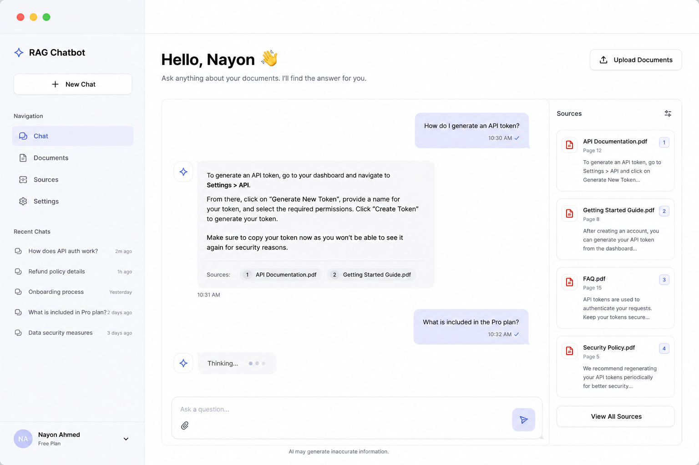

# Garden RAG

A local, PDF-focused Retrieval-Augmented Generation application for querying gardening and pesticide manuals. It uses LangChain and ChromaDB to retrieve relevant document chunks, then Qwen 2.5 0.5B Instruct to generate grounded answers with source citations.

## Features

- Multi-PDF ingestion and title-aware chunking with Unstructured
- Persistent ChromaDB vector database
- Hugging Face embeddings and Qwen 2.5 0.5B Instruct generation
- Session-based chat history with retrieved source citations
- Flask web interface with responsive source cards
- Application-lifetime model, embedding, Chroma, and retriever singletons
- Streaming token responses and optional stage-level performance logging

## Folder structure

```text
.
├── app.py
├── chat_store.py
├── config.py
├── rag.py
├── vectorize.py
├── requirements.txt
├── static/
│   ├── css/style.css
│   ├── js/app.js
│   └── images/
├── templates/index.html
├── data/
└── .rag_chroma/
```

## Installation

Use Python 3.12 or later. Create and activate a virtual environment:

```powershell
python -m venv .venv
.\.venv\Scripts\Activate.ps1
```

Install the project dependencies:

```powershell
pip install -r requirements.txt
```

For production deployments, set a stable Flask secret key before starting the server:

```powershell
$env:FLASK_SECRET_KEY = "replace-with-a-long-random-secret"
```

## Build the vector database

Place PDF manuals in `data/`, then build the local index:

```powershell
python vectorize.py
```

To replace the existing index after changing the PDFs:

```powershell
python vectorize.py --rebuild
```

## Run the application

```powershell
python app.py
```

Open `http://127.0.0.1:5000` in a browser.

Set `RAG_DEVELOPMENT_MODE=true` to log embedding, retrieval, prompt, and generation timing for each response.

## Screenshots


## Technologies

- Flask
- LangChain
- ChromaDB
- Hugging Face Transformers
- Qwen 2.5 0.5B Instruct
- Sentence Transformers
- Unstructured
